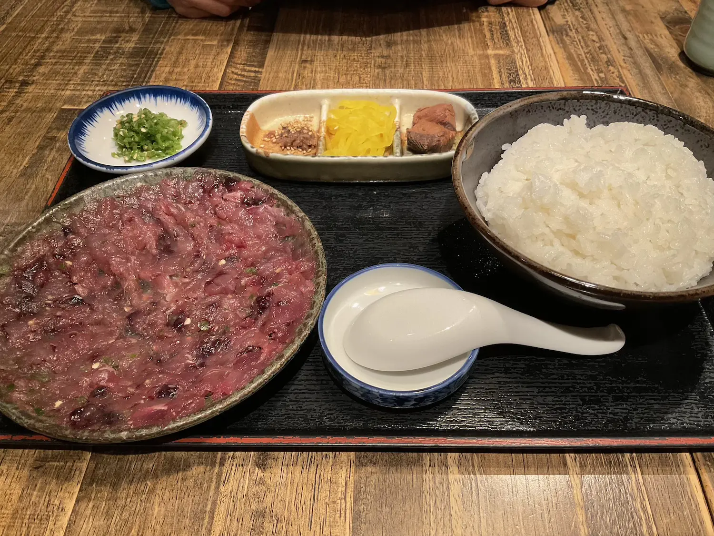
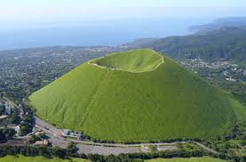
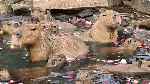

```{=html}
<canvas id="confetti"></canvas>
<div class="wrap">
  <div class="header">
    <span class="badge">🎂 Birthday Site / made with love</span>
    <p>誕生日おめでとう！誕生日をお祝いできるようにwebpageを作ったよ！</p>
  </div>

  <div class="grid">
    <div class="card hero">
      <p>メッセージ</p>
      <div class="big">
        Happy birthday!<br>
        去年の誕生日から数え切れないくらい遊んで思い出を作ったね！<br>
        毎年誕生日を祝うたびに、思い出が増えたことを実感してすごく嬉しいよ！<br>
        これからも数え切れないぐらいの思い出を作ろうね！
        いつもありがとう。誕生日を祝えてとっても嬉しいよ！
      </div>
      <div class="btns">
        <button class="primary" id="btnConfetti">🎉 祝う（紙吹雪）</button>
        <button id="btnReveal">🔒 もうひとつのメッセージ</button>
      </div>
      <div id="secret" class="secret">
        <h3>質問：好きの2段階上は</h3>
        <div class="inputrow">
          <input id="pass" placeholder="回答を入力してね">
          <button id="btnUnlock">開く</button>
        </div>
        <p id="lockedMsg" class="small"></p>
      </div>
    </div>

    <div class="card">
      <h2>旅のしおり</h2>
      <div class="linkcard">
        <div>
          <div class="small">当日の流れ・予約情報</div>
          <div class="strong">
            <a id="itineraryLink" href="#" target="_blank" rel="noopener">旅のしおりを開く →</a>
          </div>
        </div>
        <div class="emoji">🗺️</div>
      </div>

      <h2>伊東の見どころ＆名物</h2>
      <div class="gallery">
        <div class="gitem">
          <a class="imglink" href="https://ito-marugen.com/" target="_blank" rel="noopener">
            
          </a>
          <div class="gcap">
            <strong>名物料理：うずわめし / 干物 / 金目鯛</strong>
            <ul class="tips">
              <li><b>うずわめし</b>はソウダガツオを薬味とたたいた漁師飯。醤油→ご飯→だし茶漬けで味変するのが定番。</li>
              <li><b>干物</b>は伊東の定番。凍ったまま焼くと旨味が逃げにくい。</li>
              <li><b>金目鯛</b>は煮付け・刺身・寿司が王道。誕生日感も出る。</li>
            </ul>
            <p class="source">出典: <a href="https://www.tabirai.net/localinfo/article/article-32054/" target="_blank" rel="noopener">Tabirai</a></p>
          </div>
        </div>

        <div class="gitem">
          <a class="imglink" href="https://omuroyama.com/" target="_blank" rel="noopener">
            
          </a>
          <div class="gcap">
            <strong>大室山</strong>
            <div class="small">リフトで登って山頂を一周。景色で「伊豆来た感」が出る。</div>
            <p class="source">出典: <a href="https://omuroyama.com/" target="_blank" rel="noopener">大室山公式サイト</a></p>
          </div>
        </div>

        <div class="gitem">
          <a class="imglink" href="https://izushaboten.com/" target="_blank" rel="noopener">
            
          </a>
          <div class="gcap">
            <strong>伊豆シャボテン動物公園</strong>
            <div class="small">カピバラ露天風呂やふれあい体験が人気。</div>
            <p class="source">出典: <a href="https://izushaboten.com/" target="_blank" rel="noopener">伊豆シャボテン動物公園公式サイト</a></p>
          </div>
        </div>
      </div>
    </div>
  </div>
</div>
```
